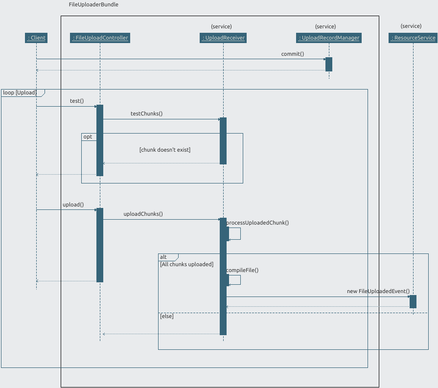
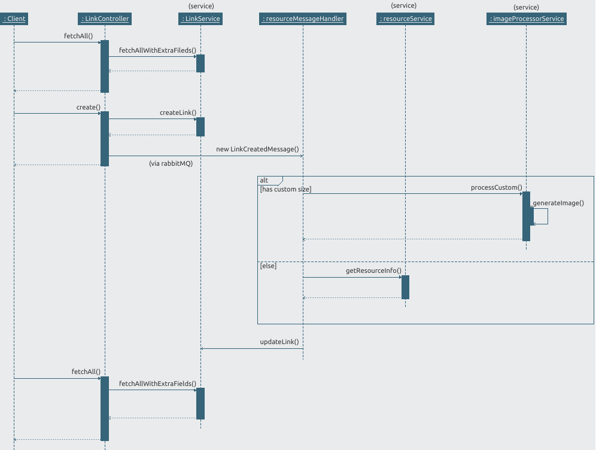
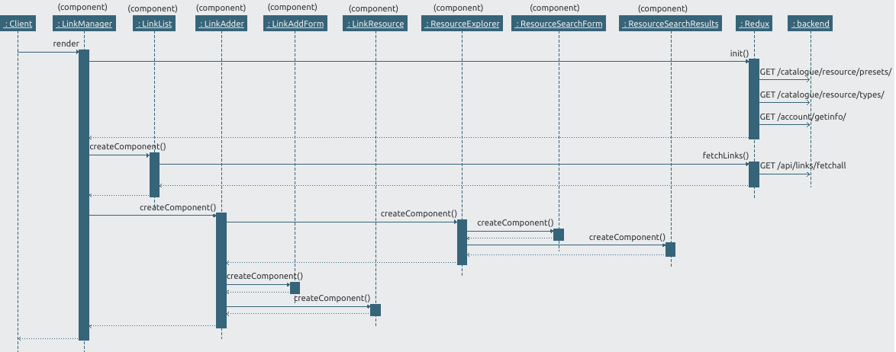
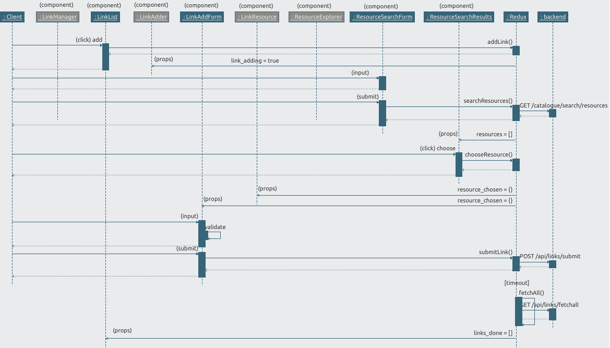

# PhotoBank

1. Введение

   Привет, наш продукт называется "Фотобанк". Разработка началась в начале осени 2018
в составе двух разработчиков - Кирилл Лавров и Дмитрий Ефимов.
Техническое задание на разработку годом ранее было детально сформулировано
в одном предложении: "Нужно веб хранилище для фотографий".
Поскольку была предоставлена полная свобода в выборе стэка технологий - я с радостью
отказался от ранее принятого в компании стандарта для разработки сайтов на MODx в пользу
PHP фреймворка [Symfony ver.4](https://symfony.com/).
С Frontend частью было не все так однозначно: с одной стороны прекрасный фреймворк
Angular ver.4++ с четко выстроенным workflow и "из коробки" мощным защитником от ошибок
typescript. С другой стороны популярная библиотека React со своими достоинствами, которые
в этом конкретном случае оказались в приоритете - выбор пал на связку React+Redux.
   Я постарюсь в этом тексте в достаточной мере описать всё необходимое для того, чтобы
можно было быстро приступить к поддержке продукта и продолжить его совершенствование
в едином стиле. (не мало я видел систем, которые я бы охарактеризовал словом "паутина", а
череду разработчиков этих систем сравнил бы с пауками, которые в единственном экземпляре
знают что/где находится, а спустя пару-тройку лет эти проекты не только не могут
дальше расти, но и их поддержка становится тяжким бременем. Я верю - нам удастся
этого избежать).
   В то же время, здесь не будет "вендорной" документации: подразумевается, что человек,
который будет поддерживать систему, обладает достаточной квалификацией в используемом стэке.
Будут описаны только особенности (если есть) применения вендорных компонент в нашем
продукте. Так же я отдельно опишу архитектурные паттерны которые мы выбрали и стандарты,
которым очень рекомендую придерживаться. И конечно лучшее дополнение - сам код и комментарии
к нему, которые в изобилии описывают все что там происходит (\*).
   И напоследок - это "живая" документация, она будет расти и изменяться по ходу проекта.
Надеюсь, что она поможет Вам и не в последнюю очередь - мне самому - быстро восстановить
актуальную карту системы в оперативной памяти, проанализировать и принять точное решение.
Это полезнейший инструмент - берегите его!

\*. декбарь 2018 - нет ни одной строчки комментариев ;)

---

## Use cases

 - Поиск товаров.
 - Отображение прикрепленных к товарам ресурсов.
 - Поиск ресурсов.
 - Скачивание ресурсов.
 - Загрузка ресурсов для товаров на сервер.
 - Изменение метаинформации ресурсов, их типа и приоритета.
 - Генерация изображений конкретного размера.
 - Автоматическая генерация изображений с заранее заданными размерами.
 - Создание внешних ссылок для открытого доступа к ресурсам для неавторизованных пользователей.
 - Редактирование списка пользователей.

---

## Установка
Для работы приложения требуется окружение Nginx, php-fpm 7.1.3+, mysql 5+, rabbitmq 3.7+

Зависимости:
  * ext-ctype
  * ext-iconv
  * Symfony4
    * ext-ctype
    * ext-iconv
    * imagine/imagine
    * sensio/framework-extra-bundle
    * symfony/asset
    * symfony/console
    * symfony/dotenv
    * symfony/expression-language
    * symfony/filesystem
    * symfony/finder
    * symfony/flex
    * symfony/form
    * symfony/framework-bundle
    * symfony/messenger
    * symfony/monolog-bundle
    * symfony/orm-pack
    * symfony/process
    * symfony/security-bundle
    * symfony/serializer-pack
    * symfony/swiftmailer-bundle
    * symfony/twig-bundle
    * symfony/validator
    * symfony/web-link
    * symfony/webpack-encore-pack
    * symfony/workflow
    * symfony/yaml
    * white-october/pagerfanta-bundle
  * @babel/preset-stage-2
  * babel-preset-stage-2
  * imagemagick
  * jstree
  * materialize-css
  * prop-types
  * react
  * react-dom
  * react-jsonschema-form
  * react-redux
  * react-simple-jstree
  * redux
  * redux-thunk
  * reselect
  * Resumable.js
  * Sass
  * webpack

При установке необходимо запустить *composer install* и *yarn install* для установки зависимостей

---

> ! Во время работы приложения должны быть запущены воркеры для rabbitmq по каналам *presets, links, links_delete*, желательно по 5 на каждый.
При бесперебойной работе по неизвестным науке причинам воркеры потребляют память в геометрической прогрессии и в итоге падают. Решается это запуском bash-скриптов *symfony_worker_[exchange]* в папке *bin*. Там они запускаются с параметром *--memory-limit=10M* и перезапускаются в случае завершения работы с кодом выхода отличным от 0. На свой страх и риск можно запускать их через консольную команду - *bin/console messenger:consume-messages [имя канала]*

---

> ! Компонент Filesystem обернут в декоратор, который выкидывает ошибку, в случае, если в директории */private/uploads/* нет файла *livemount*. На момент написания, все загрузки находятся и загружаются в примонтированную директорию, и эта проверка служит для того, чтобы загрузка не считалась успешно завершенной и не создавалась запись в базе без успешного маунта.

---

Сборка js и css проходит по команде *yarn encore [dev/production] [--watch]*

В *.env* должны быть определены переменные окружения, пример структуры можно видеть в *.env.dist*

---

## API Reference

Документация апи генерируется через phpDocumentor, который нужно взять [отсюда](https://github.com/phpDocumentor/phpDocumentor2/releases) и сложить в bin.
Генерация запускается по команде **"php ./bin/phpDocumentor.phar run -d src/ -t docs/api/"** из корневой директории проекта.

Есть пара прикольных особенностей. На момент написания последняя стабильная версия документора - 2.9.0, и ***в теории*** она должна поддерживать синтаксис PHP 7+, но на практике отказывается парсить Entity доктрины и игнорирует все комментарии. 3.0.0 на этапе активной разработки и имеет пару неприятных багов.

---

## Сущности

 - **CatalogueNode** - раздел каталога. Берется изначально из 1С. Имеет одного родителя, может иметь дочерние ресурсы как в виде других разделов, так и товаров каталога(на любом его уровне вложенности)
 - **CatalogueNodeItem** - товар каталога. Может иметь привязанные к нему ресурсы.
 - **Resource** - Картинка. Как оригиналы, так и "пресеты" имеют отдельные записи в базе. Привязаны к товарам один-к-многим.
 - **Link** - Ссылка на ресурс для внешнего доступа. Может указывать на существующий ресурс либо на сгенерированныый файл с нестандартным размером.
 - **Upload** - Относится к *FileUploaderBundle*. Является начатой, но не законченной загрузкой одного файла.

---

## Messenger

Некоторые вещи, которые не должны выполняться синхронно, либо сильно нагружают систему, отрабатывают через компонент *symfony/messenger*. Очередь задач реализована средствами RabbitMQ. Таким образом работают:

 - Генерация пресетов для ресурсов
 - Создание внешних ссылок
 - Удаление внешних ссылок

В .env должен быть описан транспорт для мессенджера. Пример можно найти в .env.dist.

---

## Загрузка файлов на сервер

Отправка файлов на frontend осуществляется за счет библиотеки [Resumable.js](https://github.com/23/resumable.js). За загрузку файлов на backend отвечает ~~модуль */src/PhotoBank/FileUploaderBundle*~~ теперь вендорный компонент [photobank/file-uploader-bundle](https://packagist.org/packages/photobank/file-uploader-bundle).

Когда файлы готовятся к отправке создается запись в базе данных о новой сущности *Upload*. Это происходит для того, что бы если загрузка прервалась и сессия клиента закончилась, можно было продолжить отправку при повторной попытке, а не начинать сначала. Когда загрузка заканчивается успешно, запись в базе удаляется.

Для того, чтобы можно было распознать файл, который ранее уже отправлялся, на клиентской части создается уникальный ключ для каждого файла. Сначала в CRC32 передаются все данные файла, затем полученная строка конкатенируется с 1С кодом товара и размером файла в байтах и передается в md5. Полученная строка в итоге будет названием файла в конечной файловой системе. В случае, если будет отпрвлен один и тот же файл (даже с разным изначальным названием) для одного и того же товара, либо если произойдет коллизия двух ключей, система посчитает эти файлы одним и тем же, и создавать дубликат не будет.

При начале загрузки Resumable разобьет файлы на фрагменты, после чего сначала проверит наличие фрагмента на сервере, а затем отправит сам фрагмент POST-запросом. *FileUploaderBundle* принимает фрагменты файлов на контроллер *~~/src/PhotoBank/FileUploaderBundle/~~/vendor/photobank/file-uploader-bundle/Controller/FileUploadController* и записывает их в файловую систему, и, при получении последнего фрагмента, собирает все фрагменты в конечный файл.

*FileUploaderBundle* подразумевает наличие в получаемых запросах полей, создаваемых Resumable, таких как *resumableFilename, resumableChunkNumber, resumableTotalChunks*, а также дополнительного поля *itemId*. Саму работу по проверке наличия, записи, сбору и перемещению файлов выполняет сервис *UploadReceiver*. Для каждого товара, у которого есть активные загрузки, создается инстанс Resumable. Загрузка может начинаться как с одним Resumable-классом, так и сразу с множеством, при загрузке ресурсов для нескольких товаров сразу.

На загрузке и сборке файлов заканчивается зона ответсвенности *FileUploaderBundle* и дальнейшей обработкой занимается */src/Service/ResourceService*, который создает запись в базе и отправляет в очередь RabbitMQ сообщения для создания пресетов для загруженного файла по заданным размерам.

Пресеты - те же самые ресурсы, но автоматически сгенерированные под определенный размер. Размеры пресетов и типы ресурсов, к которым они принадлежат определены в конфигурации.

Оригиналы (файлы, загруженные пользователем) имеют gid, совпадающий с id, в то время, как пресеты имеют gid ресурса, от которого они произошли. В основном интерфейсе по отдельности отображаются только оригиналы, а их пресеты можно увидеть в табличном представлении.

### Конфигурация

Для работы react-приложения необходимо получить на frontend глобальный объект конфигурации. Сериализованная строка с полями конфигурации пишется в data-config аргумент элемента, в который react-dom рендерит компонент верхнего уровня и во время инициализации пишется в параметр глобального объекта window.
Необходимые поля:

 - */config/fileuploader.yaml*
   - commit_upload_url
   - existing_uploads_url
   - get_items_url
   - get_nodes_url
   - item_search_url
   - item_url
   - max_additional_resources
   - max_main_resources
   - remove_upload_url
   - resource_url
   - unfinished_uploads_url
   - upload_directory
   - upload_target_url
   - upload_url

 - */config/presets.yaml*
   - presets

---

## Выгрузка ссылок

Прямой доступ к ресурсам ограничен для внешнего мира. По URL, которые использует сама система, может перейти только авторизованный пользователь. Для всех остальных реализована система ссылок. Ссылки жестко привязаны к пользователю, а значит видеть, копировать и редактировать пользователь может только свои ссылки.

При желании (и правах администратора) создаваемые ссылки можно ограничить по IP адресу, по которому они будут отдаваться, максимальному количеству запросов, и сроку действия этих ссылок. Опять же, на авторизованного пользователя эти ограничения не распространяются.

Когда пользователь создает или удаляет ссылку, задача обрабатывается в порядке очереди через RabbitMQ. Соответсвующую запись в базе создает и обновляет */src/Service/LinkService*. Если указывается кастомный размер для изображения, которое будет получено по ссылке, сервисом */src/Service/ImageProcessorService/* создается новая картинка нужного размера, но не создается новый ресурс. В противном случае ссылка будет указывать на существующий ресурс в основном хранилище. Важно понимать, что при удалении ссылки должна быть удалена сгенерированная кастомная картинка, но не должен быть удален ресурс, на который она ссылается.

---

## Security и Редактор пользователей

В системе есть следующие наборы прав:

 - **ROLE_USER**
 Простой пользователь, который может искать, просматривать загруженные рсурсы без возможности их редактировать, а так же создавать ссылки.
 - **ROLE_WRITER**
 Пользователь, который может редактировать и загрузать ресурсы на сервер.
 - **ROLE_ADMIN**
 Пользователь, который может редактировать других пользователей и имеет расширенный интерфейс создания ссылок.
 - **ROLE_SUPER_ADMIN**
 Пользователь, который может все. Будем надеяться, что это вы. В частности, если этот пользователь использует GET-параметр *_switch_user* с именем пользователя, он сможет увидеть как выглядит интерфейс от любого имени.

Для пользователей с правами администратора реализован интерфейс редактирования и добавления пользователей системы. Он является по сути просто формой для редактирования полей. Получение и обновление информации проходит через методы контроллера */src/Controller/UserController*.

Права доступа для разных пользователей определены в файлах *security.yaml* в папке */config/packages/[окружение]*. Для установки прав доступа в окружении *dev* при разработке с использованием тестового сервера symfony рекомендуется устанавливать протокол http, а на production выставлять у всего https.

---

## Поиск

Поиск реализован через методы *search([SearchObjectClass] SearchObject)* репозиториев Doctrine(*/src/Repository/*). Сам запрос в репозиторий отдает */src/Service/Search/SearchService*. Классы объектов поиска описаны в */src/Entity/Search/* и должны имплементировать интерфейс */src/Entity/Search/SearchQueryInterface*. При поиске должен вызываться соответствующий метод */src/Service/SearchQueryBuilder*, а объект, полученный в результате, должен передаваться в */src/Service/SearchService*.

> ! Поиск ресурсов и товаров во вложенных разделах каталога сделан через цепочку JOIN-ов, что делает его непроизводительным.

---

## Frontend

### JS

Все исходники компонентов и библиотек находятся в директории */assets/js*. На верхнем уровне этой директории находятся входные точки для Webpack, которые в свою очередь импортируют все необходимые скрипты и собираются в итоге в */public/build*. Для каждой страницы фотобанка есть свой файл js и css, в которых лежит только то, что нужно.

 - */account/*, */photobank/*, */usermanager/*
   - React-приложения для соответствующих страниц.
 - */forms/*
   - Часть форм реализованы с помощью компонента [react-jsonschema-form](https://github.com/mozilla-services/react-jsonschema-form), для которого в данной папке лежат схемы для автоматической генерации форм, кастомные поля, виджеты, и React-компонент *FormWrapper* для абстракции. В файлах схемы расположена не только сама схема, но и отдельные UI-схемы для обычного пользователя и администратора. Там же импортируются кастомные элементы форм для отображения
 - */services/*
   - Для отделения логики представления и всего остального, что может происходить на клиенсткой стороне, некоторый функционал выведен в сервисы со статичными методами. Здесь в частности определен класс *NotificationService*, который выводит оповещения и ошибки.
 - */vendor/*
   - Как намекает название данной директории, здесь расположены различные third-party скрипты, импортированные не как node-модули, а как статичные ресурсы.
 - */common/*
   - Прочие компоненты, библиотеки и утилиты, которые не обязательно привязаны к конкретной части приложения.

#### Интерфейс загрузки /upload

Иерархия react-компонентов:
   - PhotoBank
     - CatalogueTree
       - ItemSearch
       - TreeView (react-simple_jstree)
     - NodeViewer
       - ItemSection
         - DownloadPool
         - UploadPool
         - ExistingResources
         - Uploads
           - UnfinishedUploads
       - ItemList
         - ListFilter

Для сохранения состояния интерфейса между сессиями, в LocalStorage браузера записывается ряд полей, которые отвечают за выбранный раздел каталога, выбранный товар, тип отображения существующих ресурсов и т.д.

Интерфейс состоит из 3 колонок, которые верхнеуровнево определены компонентами CatalogueTree, ItemList и ItemSection.
CatalogueTree - браузер каталога. Может быть представлен как дерево директорий(по дефолту), плоский список либо как окно поиска. Дерево зависит от вендорного компонента react-simple-jstree. Все три варианта опираются на одну структуру данных, которая хранится в state компонента и обновляется асинхронно.

>После того, как раскрывается раздел каталога, данные о вложенных разделах остаются в памяти даже если пользователь сворачивает раздел

ItemList отражает список товаров в выбранном разделе каталога, если такие есть. Ограничены 100 элементами, если отражаются результаты поиска.

ItemSection содержит в себе интерфейс загрузки(Uploads, UploadPool), выгрузки(DownlaodPool), просмотра существующих ресурсов(ExistingResources), менеджмента прерванных загрузок(Uploads->UnfinishedUploads).

#### Интерфейс создания внешних ссылок /account

Иерархия react-компонентов:
   - LinkManagerWrapper
     - LinkManager
       - LinkList
       - LinkAdder
         - ResourceExplorer
           - ResourceSearchForm
             - [FormWrapper]
           - ResourceSearchResults
         - LinkAddForm
           - [FormWrapper]
         - LinkResource

Приложение состоит также из трех колонок, две из которых скрыты до начала добавления ссылки. После начала добавления ссылки первая колонка становится недоступна. Формы поиска ресурсов и добавления ссылки строятся с помощью компонента react-jsonschema-form. Схемы для построения форм находятся в директории *assets/js/forms/schema*. Файлы схемы делятся на три секции: сама структура формы, ui-схема для обычного пользователя и администратора. Формы создаются компонентом FormWrapper, в который нужно передать ключ конкретной формы, которую нужно построить, а он сам уже подставит нужную конфигурацию в вендорный компонент.

На странице отлавливаются события нажатия комбинаций клавиш Ctrl-S и Ctrl-C для простоты использования, которые сохраняют файл с текстом ссылок, либо копируют их в буфер обмена

##### Инициализация компонента

##### Создание ссылки

##### Удаление ссылки

#### Интерфейс редактирования поьзователей /usermanager

Иерархия react-компонентов:
  UserManager
   - UserList
   - UserEditor

Самый простой интерфейс фотобанка. Представляет из себя просто список юзеров и форму для их редактирования.

### SCSS

 - *account.scss*, *photobank.scss*, *usermanager.scss*
   - Входные точки для Webpack, в которых импортируются нужные модули для конкретных страниц
 - */account/*, */photobank/*, */usermanager/*
   - Sass-стили для конкретных страниц.
 - */common/*
   - Общие стили

Были предприняты попытки верстать проект по принципам БЭМ, но в результате общей хаотичности процесса блочной и независимой оказалась не вся верстка. Не смотря на это, все стили, которые должны распространяться на разные блоки, следует определять в */common/mixins*.

---

## Тесты

Для тестирования необходимо определить в *phpunit.xml.dist* url на дополнительную, тестовую бд. Также параметр *UPLOADS_PARENT* в тестовом окружении должен указывть на дополнительный путь файловой системы, отличный от рабочей папки боевой системы, например *private/test/* вместо *private/*. Дополнительная конфигурация указана в файле конфигурации */config/tests.yaml*.
Перед проведением тестов следует выполнить команду *bin/console app:tests:prepare*, которая удалит тестовую базу данных и импортирует ее заново из дампа, путь к которому указан в файле конфигурации, а также скопирует фрагмент директории *uploads*. Также система сделает выборку из тестовой базы и запишет входные данные для тестов в файл *datasample.txt* в виде сериализованной Json-строки. После этого можно просто запустить тесты командой *bin/phpunit*. Без запущенного RabbitMQ с воркерами будут фэйлы.

> На всякий случай, если **bin/console app:tests:prepare** виснет и потом пишет в консоль **очень много текста**, может помочь **SET GLOBAL max_allowed_packet=524288000;** в mysql.

Все новые функциональные тесты должны наследовать класс */tests/Controller/BaseTest*. В нем реализован функционал создания mock-клиента для функционального тестирования и получения данных для тестов.

---

## Config

> Все ссылки, выведенные в конфигурацию, не влияют на непосредственный адрес, по которому должен обращаться браузер. При их изменении необходимо также обновить соответсвующую аннотацию в контроллере.

---

Конфигурация для функционала загрузки содержится в файле */config/fileuploader.yaml*
 - upload_directory - Конечная директория для загруженных файлов
 - upload_target_url - URL, по которому должны идти запросы для загрузки файлов
 - existing_uploads_url - URL для получения информации по существующим ресурсам
 - unfinished_uploads_url - URL для получения информации по незаконченным загрузкам
 - commit_upload_url - URL для создания записи о начавшейся загрузке
 - remove_upload_url - URL для удаления записи о загрузке
 - resource_url - URL для получения информации о конкретном ресурсе
 - item_url - URL для получения информации о товаре каталога
 - item_search_url - URL дла поиска товара каталога
 - get_nodes_url - URL для получения информации о разделах каталога
 - get_items_url - URL для получения информации о товарах по id родительского раздела каталога
 - upload_url - URL для перехода к интерфейсу загрузки
 - max_main_resources - Максимальное количество ресурсов типа "Основной" у одного товара
 - max_additional_resources - Максимальное количество ресурсов типа "Дополнительный" у одного товара

---

Конфигурация пресетов находится в файле */config/presets.yaml*
 - presets - Непосредственно пресеты. Должны иметь *id, name, width, height*
 - preset_collections - Списки пресетов, которые должны генерироваться автоматически для каждого типа ресурсов. Представлены в виде массивов *id* пресетов

---

Конфигурация для ссылок находится в */config/links.yaml*
 - link_url_prefix - URL для получения ресурсов по сгенерированным ссылкам
 - link_fs_path - Подпапка для хранения гренерированных изображений для ссылок, которые не указывают на статичный ресурс. Является подпапкой основного хранилища, путь к которому указан в *.env*

---

Конфигурация для бандла FileUploader находится в файле */config/packages/photo_bank_file_uploader*
 - **front**:
    - target_url - URL для загрузки файлов
    - chunk_size - Размер одного фрагмента файла для загрузки в байтах
    - simultaneous_uploads - Количество одновременных загрузок для одной инстанции Resumable
 - **back**:
    - destination_dir - Подпапка для хранения файлов
    - temp_dir - Путь для хранения фрагментов файлов во время загрузки
    - upload_directory - Путь к месту хранения ресурсов после загрузки

---

> Каналы связи для rabbitmq должны быть определены в */config/packages/messenger.yaml*

> Настройки системы авторизации находятся в */config/security*

---

## Console

Ряд операций для работы с системой реализованы через консоль Symfony.

 - **app:resource:bulk-generate-presets** *[file]* - */src/Console/BulkGeneratePresetsCommand*
 Команда для генерации пресетов для ресурсов, путь к файлу с id которых через запятую необходимо передать в параметре этой команды
 - **app:resource:generate-presets** *[parent]* *[nested]* - */src/Console/GeneratePresetsCommand*
 Команда для генерации пресетов для ресурсов, которые пренадлежат к товарам, являющимися дочерними ресурсами определенного раздела каталога (*что?*). Второй параметр определяет, производится ли поиск ресурсов во вложенных разделах каталога
 - **app:resource:import**  - */src/Console/ImportResourcesCommand*
 Команда для импорта ресурсов и добавления соответствующих записей в базу данных. **[DEPRECATED]**
 - **app:resource:process-preset** *[resource]* *[preset]* *[presets]* - */src/Console/ImportResourcesCommand*
 Команда для обработки пресетов для одного ресурса. Можно указать конкретный пресет либо сразу коллекцию пресетов
 - **app:mock:catalogue-item** *[count]* *[random]* - */src/Console/Mock/MockCatalogueNodeItemsCommand*
 Команда для создания списка товаров для тестов **[DEPRECATED]**
 - **app:mock:catalogue** *[count]* *[deep]* *[flush_level]* *[force]* - */src/Console/Mock/MockCatalogueNodesCommand*
 Команда для создания структуры каталога для тестов **[DEPRECATED]**

---
